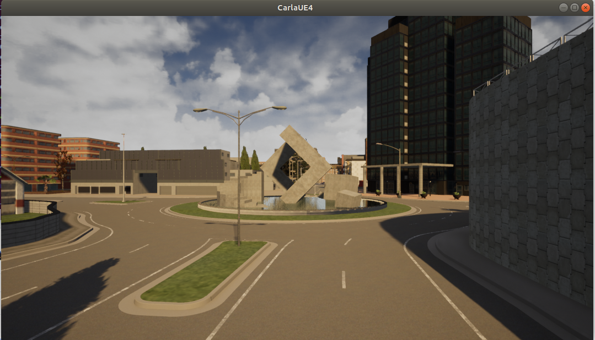
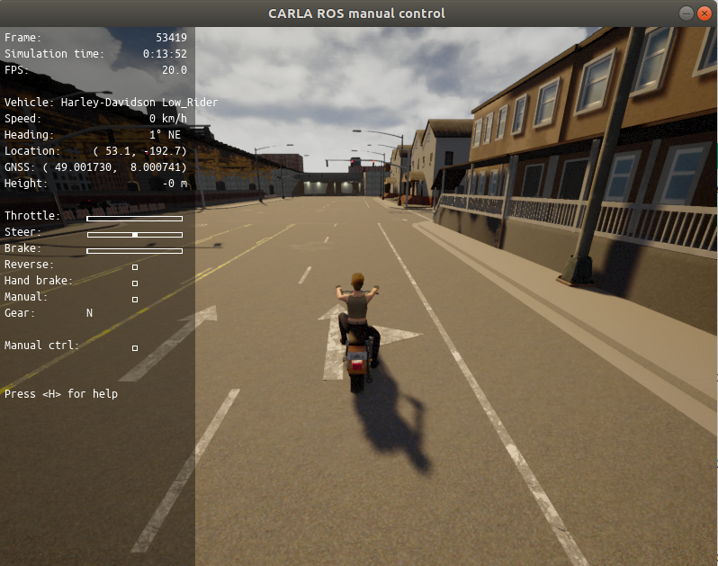

# CarlaRosBridge

## System information on which the above project is tested  
- Ubuntu 18.04 64bit  
- Nvidia 1050TI (435- Vulkan enabled)  
- i7 7th Gen  
- RAM 24GB  
- ROS melodic  

## How to load the project
- Clone the git repo by issueing the below command

       `git clone --recurse-submodules https://gitlab.kpit.com/kankans/carlarosbridge.git`.  

- Browse to the cloned folder `cd carlarosbridge`.  
- Compile the project by `catkin_make`.  
- Source the project `source devel/setup.sh` , Everytime when a new terminal is opened the **carlarosbridge** environment is sourced.
- Run ROS `roscore`.
- Run carla `./CarlaEU4.sh -windowed -ResX=400 -ResY=320` wait for the carla window to load.

- If you want to launch the carla client with RVIZ then `roslauch carlabg CarlaVehicleWithRviz`.
- If you want to launch the carla client without RVIZ then `roslauch carlabg CarlaVehicleWithoutRviz`.  

  - You can edit the lauch file to play with the carla environment.
    - You can change the spawn point of the vehicle by changing the X,Y,Z location in the above line`  <arg name="spawn_point" default="73.193413,-136.704315,9.837398,-0.647311,-178.772690,0.000000"/>` .
    - If you want to change the vehicle model edit the default model in the `  <arg name="vehicle_filter" default='vehicle.tesla.model3'/>`.
    - If you want to change the weather of the simulation then change(Cloudiness, Precipitation , SunAltitudeAngle) `<arg name="weather" default="90.0,0.0,1.0"/>` 
    - If you want to change the other actor models then change the below parameters `<arg name="NumberofVehicles" default="1"/>  <arg name="NumberofPedestrians" default="1"/> <arg name="SafeTravel" default="False"/>`.
  - You can change the sensor config in `sensors.json` (carlarosbridge/carlabg/config/sensors.json).  
- The Navigation is broken and does not work properly, however the navigation can be launched by the following command  
  - `roslaunch carlaconfig amcl_demo.launch`  <-- this also launches RVIZ with the map  

## Standard Slam Implementation
- Gmapping
  - Open Terminal and run `roscore`.
  - Open the `carla` folder in terminal and run the CarlaSimulator `CARLAUE4.sh -ResX=320 -ResY=480`.
  - Start the carla-ros bridge node , Open another terminal and run `roslaunch carlabg CarlaVehicleWithoutRviz.launch` command.
  - Start the Gmapping node `roslaunch carlabg Gmapping_Carla.launch`.
  - If you want to view the live mapping , lauch the rviz node `rosrun rviz rviz`. Either you can load the Gmapping-rviz config from `/carla/carlabg/config` folder or enable a map view under frame `map`.
  - Save the map by running map_server `rosrun map_server map_saver`.
- Hectormapping
  - Launch the carla-ros bridge same as Gmapping , and then launch the hectormapping node by running `roslaunch carlabg Hectormapping_Carla.launch`.
  - Save the map by running map_server `rosrun map_server map_saver`.
- Octomap
  - Launch octomap by `roslaunch carlabg Octomapping_Carla.launch`.
  - The octomap can be viewed using the rviz octomap plugin , load the Octomap-rviz config from `/carla/carlabg/config`.
- RTAB mapping
  - Launch RTAB map by `roslaunch carlabg RtabMapping_Carla.launch` this node will automatically launch the RTABmap viewer for map visualization.
## DNN based Visual SLAM Implementation
- Launch the Carla Simulator 0.9.7.
- Run the Visual SLAM detector by running `carlarosbridge/Slam_Tes/Visual_SLAM.py` file. It runs the detection offline edit the config here [Edit Source Config](https://gitlab.kpit.com/kankans/carlarosbridge/-/blob/21e8481e53be122de570a95d83c445de09a8f07e/Slam_Test/Visual_SLAM.py#L106), the weights and config can be edited [here](https://gitlab.kpit.com/kankans/carlarosbridge/-/blob/21e8481e53be122de570a95d83c445de09a8f07e/Slam_Test/Visual_SLAM.py#L18) , the detector speed can be increased by resizing the image refer [here](https://gitlab.kpit.com/kankans/carlarosbridge/-/blob/21e8481e53be122de570a95d83c445de09a8f07e/Slam_Test/Visual_SLAM.py#L33), if you dont want to save the output comment out this [line](https://gitlab.kpit.com/kankans/carlarosbridge/-/blob/21e8481e53be122de570a95d83c445de09a8f07e/Slam_Test/Visual_SLAM.py#L113).
- Run the Sensor Fusion Algorithm by opening `carlarosbridge/Slam_Test/SensorFusionCarla.py` [file](https://gitlab.kpit.com/kankans/carlarosbridge/-/blob/master/Slam_Test/SensorFusionCarla.py), if you want to edit the sensor noise change this [line](https://gitlab.kpit.com/kankans/carlarosbridge/-/blob/master/Slam_Test/SensorFusionCarla.py#L136) , the sensor deviation is in `g` , by default the script will automatically record the data in `KalmanTest_XXX.csv`. 
## Note
- The slam node did not work for me unless the messages are transmitted slowly.Hence while performing manual maneuver bag the messages by the following command  
`rosbag record /tf /camera/scan /carla/ego_vehicle/lidar/lidar1/point_cloud`  
- Launch Gmapping node by running following commad  
`roslaunch carlabg Gmapping_Carla.launch`  
- After the messages are logged we can playback the messages by following command  
`rosbag play -r 0.01 --clock "Your recorded file name"`  
- This will take significant amount of time to build the map (better than the below error message)  
(Error Message to be  included ;-P)    
- Once you are done with the playback , save the message by following command  
`rosrun map_server map_saver -f "Your File Name"`  
- All recorded data is stored in `/src/data/`  
- Hector and GMAPPING is tested against the two scenarios, Results are stored in the data folder `ExperintData.tar.xz`  

